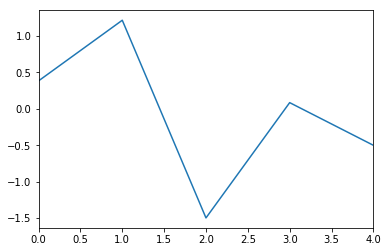
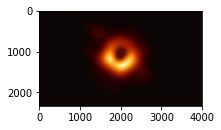

```python
import pandas as pd
```


```python
s=pd.Series([1,3,5,7,9])
```


```python
type(s)
```


    pandas.core.series.Series


```python
s.dtypes
```


    dtype('int64')


```python
s=pd.Series([True,False,True,False])
```


```python
s.dtype
```


    dtype('bool')


```python
s.index
```


    RangeIndex(start=0, stop=4, step=1)


```python
s.values
```


    array([ True, False,  True, False])


```python
f=pd.Series([[2,3,4],[1,2,3]])
```


```python
f.ndim
```


    1


```python
f.size
```


    2


```python
s.is_unique
```


    False


```python
s.is_monotonic_increasing
```


    True


```python
s.add_prefix('panda')
```


    panda0     True
    panda1    False
    panda2     True
    panda3    False
    dtype: bool


```python
s.sum()
```


    2


```python
s.mean()
```


    0.5


```python
s.std()
```


    0.5773502691896257


```python
import os
os.listdir("C:\\Users\\Kisho\\Documents\\")
```


    ['.ipynb_checkpoints',
     'basics.py',
     'cloudera',
     'desktop.ini',
     'My Music',
     'My Pictures',
     'My Videos',
     'oops.py',
     'oops2.py',
     'Python - Series.ipynb',
     'sample.csv']


```python
local_dir = "C:\\Users\\Kisho\\Documents\\"
```


```python
sample_csv = "sample.csv"
```


```python
type(pd.read_csv(local_dir+sample_csv,header=None))
```


    pandas.core.frame.DataFrame


```python
type(pd.read_csv(local_dir+sample_csv,header=None,squeeze=True))
```


    pandas.core.series.Series


```python
type(pd.read_csv(local_dir+"sample2.csv",squeeze=True,usecols=['marks']))
```


    pandas.core.series.Series


```python
s=pd.read_csv(local_dir+"sample2.csv",squeeze=True,usecols=['marks'])
```


```python
s
```


    0    200
    1    100
    2    300
    3    400
    Name: marks, dtype: int64


```python
name = ['kishore','vinay','ruchi','nitin']
```


```python
marks = [30,50,60,60]
```


```python
marks=pd.Series(data=marks,index=name)
```


```python
marks
```


    kishore    30
    vinay      50
    ruchi      60
    nitin      60
    dtype: int64


```python
marks.idxmax()
```


    'ruchi'


```python
marks.sort_values(ascending=False,inplace=True)
```


```python
marks
```


    nitin      60
    ruchi      60
    vinay      50
    kishore    30
    dtype: int64


```python
marks.sort_index(ascending=False)
```


    vinay      50
    ruchi      60
    nitin      60
    kishore    30
    dtype: int64


```python
def addMarks(m):
    return m+2
```


```python
marks.apply(addMarks)
```


    kishore    32
    vinay      52
    ruchi      62
    nitin      62
    dtype: int64


```python
marks
```


    kishore    30
    vinay      50
    ruchi      60
    nitin      60
    dtype: int64


```python
rank = {30:4,50:3,60:1}
```


```python
marks.map(rank)
```


    kishore    4
    vinay      3
    ruchi      1
    nitin      1
    dtype: int64


```python
os.listdir(local_dir)
```


    ['.ipynb_checkpoints',
     'adult_data.csv',
     'basics.py',
     'cloudera',
     'desktop.ini',
     'My Music',
     'My Pictures',
     'My Videos',
     'oops.py',
     'oops2.py',
     'Python - Series.ipynb',
     'sample.csv',
     'sample2.csv']


```python
df=pd.read_csv(local_dir+"adult_data.csv",index_col=0)
```


```python
df.info()
```

    <class 'pandas.core.frame.DataFrame'>
    Int64Index: 48842 entries, 0 to 48841
    Data columns (total 15 columns):
    age               48842 non-null int64
    workclass         46043 non-null object
    fnlwgt            48842 non-null int64
    education         48842 non-null object
    education_num     48842 non-null int64
    marital_status    48842 non-null object
    occupation        46033 non-null object
    relationship      48842 non-null object
    race              48842 non-null object
    sex               48842 non-null object
    capital_gain      48842 non-null int64
    capital_loss      48842 non-null int64
    hours_per_week    48842 non-null int64
    native_country    47985 non-null object
    class_labels      48842 non-null object
    dtypes: int64(6), object(9)
    memory usage: 4.3+ MB
    


```python
df.race.unique()
```


    array(['White', 'Black', 'Asian-Pac-Islander', 'Amer-Indian-Eskimo',
           'Other'], dtype=object)


```python
import pandas as pd
import matplotlib.pyplot as plt
import numpy as np
%matplotlib inline
```


```python
df=pd.DataFrame(np.random.randn(5,3),columns=['Open','High','Low'])
```


```python
df
```


<div>
<style scoped>
    .dataframe tbody tr th:only-of-type {
        vertical-align: middle;
    }

    .dataframe tbody tr th {
        vertical-align: top;
    }

    .dataframe thead th {
        text-align: right;
    }
</style>
<table border="1" class="dataframe">
  <thead>
    <tr style="text-align: right;">
      <th></th>
      <th>Open</th>
      <th>High</th>
      <th>Low</th>
    </tr>
  </thead>
  <tbody>
    <tr>
      <th>0</th>
      <td>0.384457</td>
      <td>-1.668261</td>
      <td>-0.919913</td>
    </tr>
    <tr>
      <th>1</th>
      <td>1.216510</td>
      <td>0.424648</td>
      <td>-0.991790</td>
    </tr>
    <tr>
      <th>2</th>
      <td>-1.496960</td>
      <td>0.384091</td>
      <td>-0.986236</td>
    </tr>
    <tr>
      <th>3</th>
      <td>0.085623</td>
      <td>-0.298523</td>
      <td>0.163365</td>
    </tr>
    <tr>
      <th>4</th>
      <td>-0.500102</td>
      <td>-1.844376</td>
      <td>-2.279935</td>
    </tr>
  </tbody>
</table>
</div>


```python
df['Open'].plot()
```


    <matplotlib.axes._subplots.AxesSubplot at 0x1023bbb0>





```python
import datetime as dt
```


```python
dt.date(2019,4,12)
```


    datetime.date(2019, 4, 12)


```python
dt.datetime.today()
```


    datetime.datetime(2019, 4, 12, 1, 21, 12, 324590)


```python
from PIL import Image
```


```python
i = Image.open('blackhole.jpg')
```


```python
iar = np.array(i)
```


```python
iar.shape
```


    (2330, 4000, 3)


```python
fig=plt.figure()
ax1=plt.subplot2grid((8,6), (0,0), rowspan=4, colspan=3)
ax1.imshow(iar)
```


    <matplotlib.image.AxesImage at 0x13ae0f0>





```python

```
